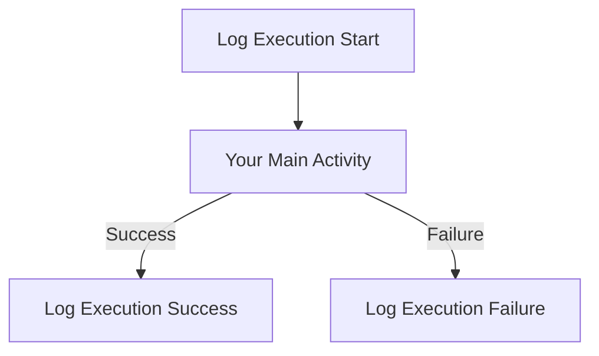

# Pipeline Execution Logging - Quick Reference Guide

This guide shows how to add execution logging to any Fabric pipeline using reusable stored procedures.

## 📋 One-Time Setup

### Step 1: Create Stored Procedures

Run this script in your **Metadata SQL Database**:
- File: [`scripts/metadata/04_create_logging_procedures.sql`](scripts/metadata/04_create_logging_procedures.sql)
- Location: Query editor in Metadata SQL Database
- Creates 3 stored procedures:
  - `usp_LogPipelineStart`
  - `usp_LogPipelineSuccess`
  - `usp_LogPipelineFailure`

### Step 2: Grant Execute Permissions

Run in Metadata SQL Database (replace `[YourWorkspace]` with your actual workspace name):

```sql
GRANT EXECUTE ON dbo.usp_LogPipelineStart TO [YourWorkspace];
GRANT EXECUTE ON dbo.usp_LogPipelineSuccess TO [YourWorkspace];
GRANT EXECUTE ON dbo.usp_LogPipelineFailure TO [YourWorkspace];
```

---

## 🔧 Adding Logging to Any Pipeline

For **every pipeline**, add these 3 Script activities:

### ✅ Activity 1: Log Execution Start

**Settings:**
- **Name**: `Log Execution Start`
- **Type**: Script
- **Connection**: Metadata SQL Database
- **Script Type**: NonQuery
- **Dependencies**: None (runs first)

**Script:**
```sql
EXEC dbo.usp_LogPipelineStart 
    @execution_id = '@{pipeline().RunId}', 
    @job_name = '@{pipeline().PipelineName}';
```

---

### ✅ Activity 2: Log Execution Success

**Settings:**
- **Name**: `Log Execution Success`
- **Type**: Script
- **Connection**: Metadata SQL Database
- **Script Type**: NonQuery
- **Dependencies**: 
  - ✅ Main activity → **Succeeded**

**Script:**
```sql
EXEC dbo.usp_LogPipelineSuccess 
    @execution_id = '@{pipeline().RunId}', 
    @job_name = '@{pipeline().PipelineName}';
```

---

### ✅ Activity 3: Log Execution Failure

**Settings:**
- **Name**: `Log Execution Failure`
- **Type**: Script
- **Connection**: Metadata SQL Database
- **Script Type**: NonQuery
- **Dependencies**: 
  - ❌ Main activity → **Failed**

**Script (Replace `YourMainActivity` with actual activity name):**
```sql
EXEC dbo.usp_LogPipelineFailure 
    @execution_id = '@{pipeline().RunId}', 
    @job_name = '@{pipeline().PipelineName}',
    @error_message = '@{activity('YourMainActivity').error.message}';
```

⚠️ **Important**: Replace `'YourMainActivity'` with your actual activity name:
- Example: `'Load Fabric Items'`
- Example: `'move data to DW'`

---

## 📊 Visual Pipeline Structure



---

## 🔍 Querying Execution History

### View Recent Executions
```sql
SELECT TOP 20 
    execution_id,
    job_name,
    start_time,
    end_time,
    result,
    DATEDIFF(SECOND, start_time, end_time) AS duration_seconds,
    error_message
FROM dbo.executions
ORDER BY start_time DESC;
```

### View Job Summary
```sql
SELECT 
    job_name,
    last_start_time,
    last_end_time,
    last_result,
    DATEDIFF(MINUTE, last_start_time, last_end_time) AS last_duration_minutes,
    updated_at
FROM dbo.jobs
ORDER BY updated_at DESC;
```

### View Failed Executions
```sql
SELECT 
    execution_id,
    job_name,
    start_time,
    error_message
FROM dbo.executions
WHERE result = 'Failed'
ORDER BY start_time DESC;
```

---

## 💡 Tips

1. **Consistent Naming**: Keep script activity names consistent across pipelines:
   - Always use: "Log Execution Start", "Log Execution Success", "Log Execution Failure"

2. **Multiple Main Activities**: 
   - If your pipeline has multiple main steps, create separate failure logging for each
   - Example: "Log Failure - Step 1", "Log Failure - Step 2"

3. **Error Message Length**: 
   - Error messages are stored as NVARCHAR(MAX)
   - The stored procedure handles NULL error messages gracefully

4. **Reusability**: 
   - Same 3 stored procedures work for ALL pipelines
   - No need to modify procedures when adding new pipelines

5. **Testing**:
   - Always test failure paths by intentionally breaking something
   - Verify error messages are logged correctly

---

## 🚀 Next Steps

1. ✅ Create stored procedures in Metadata database
2. ✅ Grant permissions to workspace/service principal
3. ✅ Add Script activities to "Load Fabric Items" pipeline
4. ✅ Add Script activities to "Load Sales" pipeline
5. ✅ Test both success and failure scenarios
6. ✅ Query execution history to verify logging works

---

**Last Updated**: 2026-04-08  
**Maintained By**: Fabric Orchestration Team
